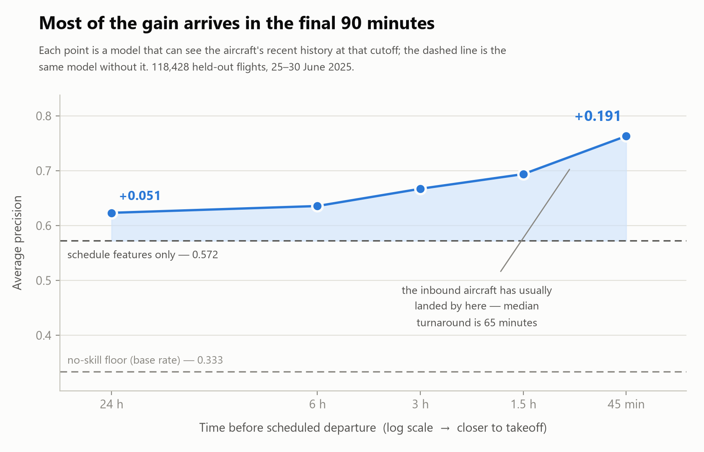
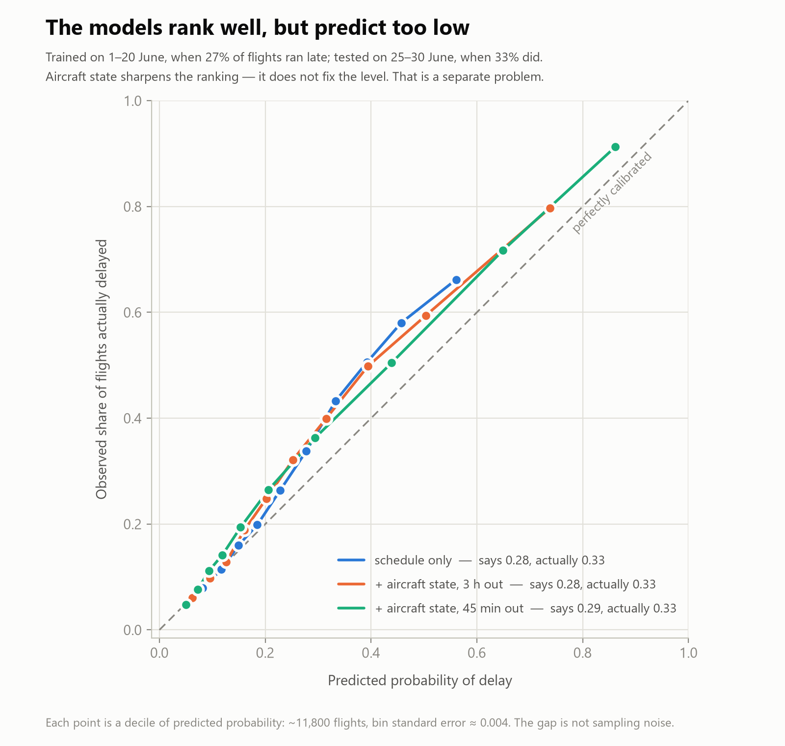

# How much is it worth knowing where your aircraft is?

[](https://github.com/ShuC802/flight-delay-rotation/actions/workflows/tests.yml)

How much does an aircraft's recent operating history improve flight-delay prediction beyond schedule information, and how does that value change as departure approaches?

Two years of US domestic flights — 13.8 million flights — evaluated at five prediction cutoffs.



## Key result

On the conservative population, which excludes flights with impossible recorded rotations, a schedule-only model reaches an average precision of **0.382** against a no-skill floor of **0.233**, a gain of **0.149**. Aircraft state adds:

| Prediction cutoff | Conservative | Upper bound | Conservative gain as a share of the timetable's value |
| --- | ---: | ---: | ---: |
| 24 hours before departure | +0.045 | +0.093 | 30% |
| 6 hours before departure | +0.062 | +0.107 | 41% |
| **3 hours before departure** | **+0.122** | +0.156 | **82%** |
| 1.5 hours before departure | +0.168 | +0.195 | 113% |
| 45 minutes before departure | +0.265 | +0.282 | 178% |

At three hours, aircraft history is worth almost as much as the timetable itself. At 45 minutes, it is worth nearly twice as much.

For the 10% of flights the model ranks as highest risk:

| Model | Share that arrived late |
| --- | ---: |
| Schedule only | 46.6% |
| + aircraft state, 3 h out | **67.4%** |
| + aircraft state, 45 min out | **83.3%** |
| *(base rate)* | *24.2%* |

The two gain columns bracket the effect of aircraft swaps. About 1.2% of flights have an impossible recorded rotation: the aircraft departs before it was scheduled to arrive. Those cases are highly delayed, but BTS records only the tail that actually flew, not when the swap was decided. Excluding them gives the conservative estimate. See [Robustness: aircraft swaps](#robustness-aircraft-swaps).

## Preventing leakage at the prediction cutoff

BTS includes `LateAircraftDelay`, but it is populated only after arrival and only for delayed flights. Even its nullity leaks the outcome. Aircraft-history features therefore have to be reconstructed from information available at each cutoff.

```sql
-- Wrong: the previous scheduled leg may still be in the air
LAG(arr_delay) OVER (
    PARTITION BY tail_num
    ORDER BY crs_dep_utc
)
```

```sql
-- Correct: the most recent leg that had already landed
ASOF LEFT JOIN flights p
       ON  t.tail_num   =  p.tail_num
      AND  t.cutoff_utc >= p.act_arr_utc
```

The naive join would use post-cutoff information on **73.4% of rows at a 3-hour horizon** and **98.1% at 24 hours**.

A chronological train/test split does not prevent this because the leak is inside each row.

| Cutoff | Naive join would leak | Conservative gain | Median age of that information at the cutoff |
| ---: | ---: | ---: | ---: |
| 90 min | 62.2% | +0.168 | 3.6 h |
| 45 min | 19.7% | +0.265 | 1.1 h |

The pivot between 90 and 45 minutes matches the median **65-minute** scheduled turnaround, both in a single month and across the full two-year dataset.

## Method

```text
BTS CSV
  → selected columns + parquet          110 columns → 21
  → UTC timestamps                      one conversion, the rest by arithmetic
  → completed, non-diverted flights
  → aircraft rotation reconstruction    ASOF join, per cutoff
  → cutoff-specific feature tables
  → chronological train / validation / test split
  → LightGBM ablation
```

Two feature sets are compared on the same test flights:

- **Schedule only:** carrier, origin, destination, distance, scheduled block time, local departure hour, day of week
- **Schedule + aircraft state:** delay of the last leg landed by the cutoff, how old that information is at the cutoff, ground time between that landing and scheduled departure, rotation continuity, scheduled turnaround

Model configuration, seed, and test population are identical for both.

All airport times are converted to UTC before aircraft legs are ordered. Only scheduled departure is converted directly; the other timestamps are derived by adding minute counts. As a cross-check, **14,054,178 of 14,055,118 rows agree to the minute** with the untouched `CRSArrTime` column; 940 disagree (0.0067%).

### Evaluation

- Average precision, with the base rate as the no-skill floor
- Brier score
- Reliability diagram
- On the full test population, the historical route × departure-hour baseline reaches **0.363** AP against a floor of 0.242; the schedule-only model reaches **0.393**

Chronological split:

| Split | Period | Flights | Delay rate |
| --- | --- | ---: | ---: |
| Train | Oct 2023 – Mar 2025 | 10,301,337 | 19.7% |
| Validation | Apr – May 2025 | 1,175,280 | 21.7% |
| Test | Jun – Sep 2025 | 2,364,298 | 24.2% |

## Calibration



On the full test population, all three models under-predict:

| Model | Mean predicted | Observed | Bias |
| --- | ---: | ---: | ---: |
| Schedule only | 0.200 | 0.242 | −0.042 |
| + aircraft state, 3 h | 0.212 | 0.242 | −0.031 |
| + aircraft state, 45 min | 0.218 | 0.242 | −0.024 |

Aircraft state reduces the bias by 43% but does not eliminate it. The remaining gap is consistent with seasonality: the test set is entirely June–September, while training contains only one summer.

## Error analysis

### The gain follows the mechanism

If delay propagates through an aircraft's day, the gain should depend on turnaround structure:

| Scheduled turnaround | Flights | Gain in AP at the 3 h cutoff |
| --- | ---: | ---: |
| ≤ 45 min | 538,535 | +0.143 |
| 45–75 min | 856,710 | +0.119 |
| 75–120 min | 237,362 | +0.100 |
| 2–6 h | 143,044 | +0.144 |
| Overnight (> 6 h) | 552,696 | +0.065 |

Overnight aircraft carry less than half as much signal as tightly rotated aircraft. The 2–6 hour bucket is the exception because, at a 3-hour cutoff, the inbound often lands near the cutoff and is both recent and already observable.

### Miscalibration is concentrated late in the day

| Local departure hour | Flights | Observed | Predicted | Bias |
| --- | ---: | ---: | ---: | ---: |
| 06:00 | 163,677 | 0.088 | 0.108 | +0.020 |
| 12:00 | 139,251 | 0.218 | 0.195 | −0.022 |
| 17:00 | 147,512 | 0.370 | 0.279 | **−0.091** |

Morning departures are slightly over-predicted; evening departures are under-predicted by up to nine points. A single recalibration constant cannot correct that shape.

### A one-month finding did not replicate

A June 2025 pilot suggested under-prediction was concentrated in the eastern US. That pattern disappears over two years. The most under-predicted airports are mostly small fields with 500–900 test flights; Denver is the only high-volume airport among them (110,915 flights, bias −0.080). The worst-biased carriers are YX (−0.059), UA (−0.053), and AS (−0.046).

The June pattern appears to have been period-specific rather than stable.

### Robustness: aircraft swaps

**169,069 flights (1.22%)** have a scheduled turnaround below zero, meaning the recorded aircraft departs before it was scheduled to arrive. **87.5%** of those flights arrive late, versus 20.6% overall.

BTS records the tail that operated the flight, not when that assignment was made, so swap timing cannot be reconstructed. Re-running the full experiment with those flights excluded from training, validation, and test gives:

| Cutoff | All flights | Excluding impossible rotations | Share surviving |
| --- | ---: | ---: | ---: |
| 24 h | +0.093 | +0.045 | 48% |
| 6 h | +0.107 | +0.062 | 58% |
| 3 h | +0.156 | +0.122 | 78% |
| 1.5 h | +0.195 | +0.168 | 86% |
| 45 min | +0.282 | +0.265 | 94% |

The swap effect is roughly fixed across horizons, so its share shrinks as departure approaches. Both estimates are reported because the data cannot identify the exact assignment time.

## Data

Source: US Department of Transportation, Bureau of Transportation Statistics, [*Reporting Carrier On-Time Performance (1987–present)*](https://www.transtats.bts.gov/Tables.asp?QO_VQ=EFD).

```text
October 2023 – September 2025

14,055,121 raw rows (110 columns)
13,840,915 flights after scope filters
     6,385 aircraft, 15 carriers
     20.6% overall delay rate (ArrDel15)
      2.97 legs per aircraft per day
```

Tail numbers make it possible to reconstruct aircraft rotations across flights. BTS covers US domestic flights only, so aircraft disappear from the dataset while operating abroad.

The window stops at September 2025 because BTS moved to a new backend in October 2025 and column names are not guaranteed to match.

### Data quality findings

| Finding | Measured | Handling |
| --- | --- | --- |
| Aircraft fly several legs per day | 2.97 / day | Required for propagation to be measurable. |
| Impossible single-aircraft schedules | 169,069 legs (1.22%); 87.5% late | Marked as having no eligible predecessor; excluded in the conservative estimate. |
| Allegiant (G4) tail numbers omit the leading `N` | 138 of 138 tails; 241,330 flights | Normalized after confirming zero collisions. |
| Flights with no tail number | 30,174, all cancellations | Removed by the cancellation filter. |
| Arrival delay is right-skewed | median −6 min, mean +7 min | Target is binary rather than delay minutes. |
| Scheduled turnaround distribution | p10 40 min, median 65, p90 628 | Median aligns with the 45-minute pivot; p90 is mostly overnight parking. |

## Run

```bash
uv sync

uv run python scripts/download.py 2023-10 2025-09   # ~7 GB of CSV
uv run python scripts/build_all.py                  # ~50 min
uv run pytest -q                                    # pipeline invariants
uv run python scripts/baseline.py
uv run python scripts/train.py                      # ~1-2 h, 12 models
uv run python scripts/plot_ablation.py
uv run python scripts/plot_calibration.py
uv run python scripts/report_numbers.py             # every figure quoted above
```

`build_all.py` deletes derived artifacts before rebuilding. `download.py` skips months already on disk, so interrupted downloads can resume.

Every number in this README comes from `report_numbers.py` or training output.

## Tests

`uv run pytest -q` checks eight pipeline invariants:

- No predecessor landed after its cutoff
- Post-hoc delay-attribution columns never reach the feature table
- Scheduled arrival round-trips through UTC to within 0.1%
- The feature table contains every column required by the models
- Every airport has a timezone
- Tail numbers are normalized
- The natural key is unique
- The analysis population contains only completed, non-diverted flights

Every push runs the whole pipeline from raw CSV to feature table and then these
eight checks, on GitHub Actions. The real input is 7 GB and cannot be committed,
so CI rebuilds from `test/fixtures/bts_sample.csv`: four days of the same BTS
file, chosen to span the 3 November 2024 daylight-saving transition so the UTC
round-trip check is genuinely exercised. The job also runs `uv sync --locked`,
which fails if `uv.lock` and `pyproject.toml` have drifted apart.

## Limitations

- **Aircraft swaps cannot be dated.** BTS records the tail that flew, not when it was assigned, so aircraft-state value is a range rather than a point estimate.
- **The test period is entirely summer.** The chronological split contributes to the remaining under-prediction.
- **The 45-minute cutoff has little decision value.** It is mainly an upper bound on the value of aircraft state.
- **Aircraft assignment is assumed known at the cutoff.** That is more plausible a few hours before departure than a day ahead.
- **This measures predictive value, not causation.** A late inbound and late departure may share a cause such as weather.
- **Historical simulation only.** Live serving would require a different data source.
- **Cancellations are excluded.** Modeling them is future work.

## Repository structure

```text
sql/
  01_raw_to_parquet.sql     110 columns -> 21, CSV -> parquet
  02_timestamps.sql         local wall-clock -> UTC
  03_analysis_table.sql     scope filters, tail normalization, target
  04_rotation.sql           ASOF join: what was knowable at each cutoff
  05_features.sql           schedule features + chronological split

src/flight_delay_rotation/   package scaffold; the pipeline runs as scripts

scripts/
  download.py               fetch BTS monthly files, resumable
  build_all.py              rebuild every derived artifact, in order
  run_sql.py                execute one .sql file
  build_airport_tz.py       IATA code -> IANA timezone
  baseline.py               historical route x hour lookup
  train.py                  ablation, both populations
  error_analysis.py         model errors and sources of gain
  robustness_check.py       headline gain with and without aircraft swaps
  report_numbers.py         every figure quoted in this README
  plot_ablation.py
  plot_calibration.py

test/
  test_pipeline.py          eight invariants
  fixtures/                 four-day sample so CI can rebuild from raw

.github/workflows/
  tests.yml                 rebuild + invariants on every push

reports/
  ablation.png
  calibration.png

data/                       gitignored; regenerate with download.py + build_all.py
```

## License

Flight data: US Department of Transportation, Bureau of Transportation Statistics. US government work, public domain.

Code: MIT.
